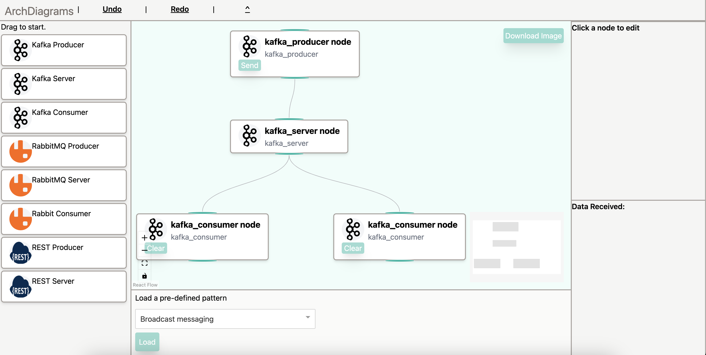

This is the frontend prototype of the arch-diagrams. It's the toy project created while learning React.

It uses technology like React, Vite, TailWind etc. The diagram ability is powered by [React Flow](https://reactflow.dev/).

# Start
To start the web server. Run the following command.

```
npm install && npm run dev
```

Then you can access the web UI at http://localhost:5173/. It will try to establish a Websocket connection to the backend service which should be running at port 8080. 

